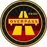

# CS:GO Map Icons/Pins

       & more ...

---

## Files origin:

Icons are directly extracted from game files with [GCFScape](https://developer.valvesoftware.com/wiki/GCFScape). 

```
steamapps
|-- common
    |-- Counter-Strike Global Offensive
        |-- csgo
            |-- pak01_dir.vpk
```

```
pak01_dir.vpk
|-- root
    |-- materials
        |-- panorama
            |-- images
                |-- map_icons
```

## IMPORTANT NOTE
I do not have any rights on this pictures and this repo is just made for easier access to the icons.
