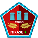
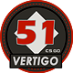

# CS:GO Map Icons/Pins

       & more ...

---

## Files origin:

Icons (80x80 and svg) are directly extracted from game files with [GCFScape](https://developer.valvesoftware.com/wiki/GCFScape). 

```
steamapps
|-- common
    |-- Counter-Strike Global Offensive
        |-- csgo
            |-- pak01_dir.vpk
```

```
pak01_dir.vpk
|-- root
    |-- materials
        |-- panorama
            |-- images
                |-- map_icons
```

### Other dimensions

Files other than 80x80 and svg are created using `svg2png.py`, a python script which use [Inkscape](https://inkscape.org/).

You can use it if you want to make png of other dimensions. It works with a folder or a file as input.
```bash
python svg2png svg/ --size 512x512
```

It was only tested on Linux and might not work on Windows.


## IMPORTANT NOTE
I do not have any rights on this pictures and this repo is just made for easier access to the icons.
